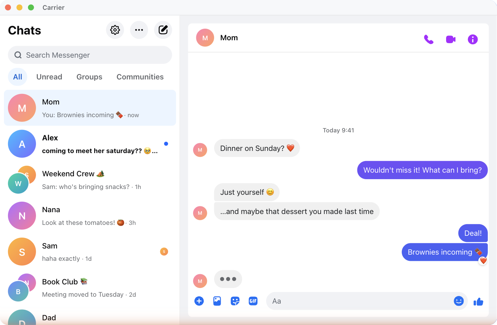

<p align="center">
  
</p>

<h1 align="center">Carrier for Messenger</h1>

<p align="center">
  <strong>Facebook Messenger without the Facebook clutter.</strong><br>
  A free, open-source desktop app for macOS, Windows, and Linux.
</p>

<p align="center">
  <a href="https://github.com/kristofferR/Carrier/releases/latest"></a>
  <a href="https://github.com/kristofferR/Carrier/actions/workflows/ci.yml"></a>
  <a href="LICENSE"></a>
</p>

<p align="center">
  <a href="https://kristofferr.github.io/Carrier/">
    
  </a>
</p>

<h2 align="center">Download</h2>

<table align="center">
  <tr>
    <td align="center" width="220">
      <a href="https://github.com/kristofferR/carrier/releases/download/v1.6.0/Carrier_1.6.0_mac_arm.dmg">
        <br>
        <strong>Download for macOS</strong><br>
        <sub>Apple Silicon &middot; .dmg</sub>
      </a>
    </td>
    <td align="center" width="220">
      <a href="https://github.com/kristofferR/carrier/releases/download/v1.6.0/Carrier_1.6.0_win_x64_setup.exe">
        <br>
        <strong>Download for Windows</strong><br>
        <sub>64-bit installer &middot; .exe</sub>
      </a>
    </td>
    <td align="center" width="220">
      <a href="https://github.com/kristofferR/carrier/releases/download/v1.6.0/Carrier_1.6.0_lin_x64.AppImage">
        <br>
        <strong>Download for Linux</strong><br>
        <sub>AppImage &middot; x64</sub>
      </a>
    </td>
  </tr>
</table>

<p align="center">
  <sub>
    Intel Mac, Windows ARM, Linux ARM, portable Windows, <code>.deb</code>, or <code>.rpm</code>?
    <a href="https://github.com/kristofferR/Carrier/releases/latest">See every download →</a>
  </sub>
</p>

<p align="center">
  <code>brew install --cask kristofferR/tap/carrier</code>
</p>

---

Meta discontinued its Messenger desktop apps, then retired the standalone
`messenger.com` experience. Carrier brings the focused desktop experience back:
it opens `facebook.com/messages` in a dedicated window and removes Facebook's
Feed, Reels, Marketplace, global search, and other surrounding chrome.

Carrier uses the operating system's WebView through
[Tauri](https://tauri.app), rather than shipping another copy of Chromium. The
macOS and Windows installers are roughly **2–3.5 MB**, while still providing
native notifications, unread badges, tray integration, global shortcuts, and
cryptographically verified updates.

## Why Carrier?

- **Just your conversations** — no Feed, Reels, Marketplace, or browser tabs.
- **Small by design** — one system WebView instead of a bundled browser engine.
- **Real desktop notifications** — including background delivery, notification
  sound controls, muted notifications, and hidden previews.
- **At home on your desktop** — unread badges, tray or menu-bar operation,
  start-on-login, a global show/hide hotkey, and remembered window placement.
- **Made for focus and screen sharing** — force light or dark mode, adjust page
  zoom, use system emoji, or temporarily hide names and avatars.
- **Useful Messenger extras** — fast conversation navigation, better media
  viewing, richer context menus, and external links that bypass Facebook's
  tracking redirect.

## Features

### Desktop integration

- Native notifications with sender avatars and optional hidden previews
- Notification sound and mute controls
- Unread count on the Dock or taskbar icon
- Tray support, start to tray, start on login, and hide on close
- Optional system-wide <kbd>Cmd/Ctrl</kbd>+<kbd>Shift</kbd>+<kbd>M</kbd> hotkey
- Menu-bar-only mode on macOS
- Always on top and experimental multi-window support
- Window size and position restored between launches

### Appearance and focus

- Forced light or dark theme, or follow the operating system
- Adjustable and persistent page zoom
- Optional system emoji instead of Facebook's emoji sprites
- Hide names and avatars for screen sharing or working in public
- Optional top application menu on Windows and Linux

### Messenger tools

- Jump directly to conversations and cycle through them from the keyboard
- Toggle the conversation information sidebar
- Search conversations or the active thread without reaching for the mouse
- Double-click photos and videos for zooming and panning
- Copy, download, and open message media from richer right-click menus
- Copy images that Messenger exposes only as in-page blobs
- Voice and video call permissions
- Spell-check controls

### Maintenance

- Automatic signed-update discovery at startup and every four hours (optional),
  with consent-based installs from Settings or <kbd>F2</kbd>
- A diagnostics log for Messenger markup changes and integration failures
- A dedicated Settings window, available with <kbd>F3</kbd>
- Optional, best-effort `custom.css` styling from **Settings → Advanced**

<details>
<summary><strong>Keyboard shortcuts</strong></summary>

| Shortcut | Action |
| --- | --- |
| <kbd>Cmd/Ctrl</kbd>+<kbd>1</kbd>–<kbd>9</kbd> | Jump to a conversation |
| <kbd>Ctrl</kbd>+<kbd>Tab</kbd> / <kbd>Ctrl</kbd>+<kbd>Shift</kbd>+<kbd>Tab</kbd> | Next / previous conversation |
| <kbd>Cmd/Ctrl</kbd>+<kbd>]</kbd> / <kbd>Cmd/Ctrl</kbd>+<kbd>[</kbd> | Next / previous conversation |
| <kbd>Cmd/Ctrl</kbd>+<kbd>Shift</kbd>+<kbd>N</kbd> | New conversation |
| <kbd>Cmd/Ctrl</kbd>+<kbd>N</kbd> | New window |
| <kbd>Cmd/Ctrl</kbd>+<kbd>K</kbd> | Search conversations |
| <kbd>Cmd/Ctrl</kbd>+<kbd>F</kbd> | Search in the active conversation |
| <kbd>Cmd/Ctrl</kbd>+<kbd>L</kbd> | Focus the message input |
| <kbd>Cmd/Ctrl</kbd>+<kbd>E</kbd> / <kbd>G</kbd> / <kbd>T</kbd> | Emoji / GIF / attach files |
| <kbd>Cmd/Ctrl</kbd>+<kbd>Shift</kbd>+<kbd>I</kbd> | Toggle conversation information |
| <kbd>Cmd/Ctrl</kbd>+<kbd>Shift</kbd>+<kbd>H</kbd> | Hide names and avatars |
| <kbd>Cmd/Ctrl</kbd>+<kbd>Shift</kbd>+<kbd>M</kbd> | Show or hide Carrier globally, when enabled |
| <kbd>Cmd/Ctrl</kbd>+<kbd>-</kbd> / <kbd>=</kbd> / <kbd>0</kbd> | Zoom out / in / reset |
| <kbd>Cmd/Ctrl</kbd>+<kbd>,</kbd> | Settings |
| <kbd>Cmd/Ctrl</kbd>+<kbd>R</kbd> | Reload |
| <kbd>Cmd/Ctrl</kbd>+<kbd>Shift</kbd>+<kbd>Backspace</kbd> | Clear cache and restart |
| <kbd>Cmd/Ctrl</kbd>+<kbd>Shift</kbd>+<kbd>Alt</kbd>+<kbd>V</kbd> | Paste and match style |
| <kbd>F2</kbd> / <kbd>F3</kbd> / <kbd>F5</kbd> | Open update settings / Settings / reload |
| <kbd>Cmd/Ctrl</kbd>+<kbd>/</kbd> / <kbd>F1</kbd> | Show keyboard shortcuts |

</details>

## Privacy and trust

Carrier does not add app analytics. Messenger content is processed locally when
needed for features such as native notifications, unread badges, and privacy
blur. Messenger itself still communicates with Meta, and update checks use
GitHub Releases.

- Known Facebook analytics and logging requests can be blocked without blocking
  messaging (**Settings → Advanced → Block Facebook telemetry**, enabled by
  default).
- Off-site links open in your normal browser; Facebook tracking redirects are
  removed first.
- Updates are cryptographically verified before installation.
- macOS downloads are Developer ID signed and notarized by Apple.
- Windows builds are currently unsigned, so SmartScreen may show an
  “Unknown publisher” warning on first launch. Download only from this
  repository’s Releases page while Windows signing is being arranged.
- The complete source is available here under the MIT license.

Carrier is a privacy-respecting client for Facebook Messenger, not a private
replacement for the Messenger service. Meta's own data handling still applies.

## Install options

The primary downloads above cover Apple Silicon macOS, x64 Windows, and x64
Linux. The [latest release](https://github.com/kristofferR/Carrier/releases/latest)
also includes:

| Platform | Architectures | Packages |
| --- | --- | --- |
| macOS | Apple Silicon, Intel | `.dmg` |
| Windows | x64, ARM64 | Installer and portable `.zip` |
| Linux | x64, ARM64 | `.deb`, `.rpm`, and AppImage |

The macOS and Windows installers are about 2–3.5 MB. Linux `.deb` and `.rpm`
packages are about 4 MB; the self-contained AppImage is around 90 MB because it
bundles WebKitGTK instead of using the system package.

Carrier loads `facebook.com/messages`, so you need an account that Meta permits
to sign in there. The macOS build supports macOS 10.15 and later.

### Homebrew

The same cask token works on macOS and Linux:

```bash
brew install --cask kristofferR/tap/carrier
```

On macOS, if `Carrier.app` is already present in `/Applications`, adopt it with:

```bash
brew install --cask --adopt kristofferR/tap/carrier
```

### Arch Linux (AUR)

The [carrier](https://aur.archlinux.org/packages/carrier) package repackages
the `.deb`, so it uses the system WebKitGTK instead of bundling it:

```bash
yay -S carrier
```

## Non-goals

Carrier stays deliberately narrow. It does not add its own do-not-disturb
schedule (use the operating system’s Focus controls), emoji-style pickers, Vim
keybindings, multiple simultaneous accounts, or automated replies.

## How it works

The Rust shell opens the official Messenger web experience in the operating
system's WebView. At document start, Carrier injects a focused stylesheet and
typed feature modules that remove Facebook chrome and add desktop behavior.

Because Facebook is a remote origin, page features communicate with the native
shell through narrowly scoped Tauri plugins and events. Off-site navigation is
routed to the default browser, downloads are restricted to expected media, and
the window hides to the tray when configured.

Messenger is a remote service and its markup changes occasionally. Carrier logs
integration failures locally and ships fixes through its signed updater.

## Build from source

Requires [Rust](https://rustup.rs), [Bun](https://bun.sh), and the
[Tauri prerequisites](https://v2.tauri.app/start/prerequisites/) for your OS.

```bash
git clone https://github.com/kristofferR/Carrier.git
cd Carrier
bun install
bun run dev
bun run build
```

The injected scripts are authored in TypeScript under [`inject/src/`](inject/src/)
and bundled into single document-start scripts with `bun run build:inject`.

## Support and contributing

If Facebook changed something, a feature stopped working, or you have an idea,
[open an issue](https://github.com/kristofferR/Carrier/issues). Include your
operating system and Carrier version when reporting a problem.

If Carrier is useful to you, consider
[starring the repository](https://github.com/kristofferR/Carrier). It helps other
people looking for a Messenger desktop client find the project.

## Disclaimer

Carrier is an unofficial, independent project. It is not affiliated with,
endorsed by, or sponsored by Meta Platforms, Inc. “Facebook” and “Messenger” are
trademarks of their respective owners. Carrier does not modify Facebook's
servers or data; it changes the presentation locally in your own window.

## License

[MIT](LICENSE) © 2026 kristofferR
